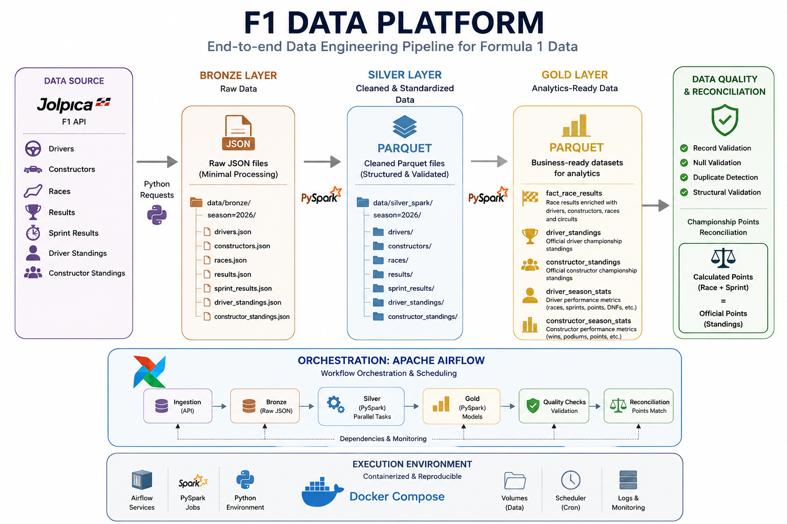

# 🏎️ F1 Data Platform

An end-to-end data engineering project that builds an automated data pipeline for Formula 1 data using **Python, PySpark, Apache Airflow and Docker**.

The platform ingests Formula 1 data from the Jolpica API, processes it through a **Medallion Architecture (Bronze, Silver and Gold)**, performs automated data quality checks and reconciles calculated championship points against official standings.

---

## 🎯 Project Objective

The goal of this project is to simulate a production-oriented data engineering workflow while working with real Formula 1 data.

The pipeline covers:

- API data ingestion
- Raw data persistence
- Schema enforcement
- Distributed data transformation with PySpark
- Bronze / Silver / Gold data modeling
- Analytical aggregations
- Automated data quality checks
- Cross-dataset reconciliation
- Workflow orchestration with Apache Airflow
- Containerized execution with Docker
- Scheduled pipeline execution

The pipeline currently processes the **2026 Formula 1 season** and can be parameterized for other seasons.

---

## 🏗️ Architecture



The project follows a **Medallion Architecture**, separating data processing into three layers:

### 🥉 Bronze

Raw API responses are stored as JSON with minimal modification, preserving the original source data.

### 🥈 Silver

PySpark applies explicit schemas, type conversions, normalization and structural transformations, producing standardized Parquet datasets.

### 🥇 Gold

Business-ready analytical datasets are generated from the Silver layer, including race results, championship standings and season-level statistics.

**Apache Airflow** orchestrates the workflow and manages task dependencies, scheduling and retries.

**Docker Compose** provides a reproducible environment for Airflow, Python and PySpark execution.

---

## ⚙️ Tech Stack

| Technology | Purpose |
|---|---|
| Python | Ingestion and pipeline development |
| PySpark | Distributed transformation and analytical processing |
| Apache Airflow | Workflow orchestration and scheduling |
| Docker / Docker Compose | Containerized execution environment |
| Parquet | Silver and Gold storage format |
| Requests | REST API integration |
| Pytest | Automated testing |
| Git / GitHub | Version control and source code management |

---

## 📥 Data Source

Formula 1 data is collected from the **Jolpica API**, a successor-compatible implementation of the Ergast F1 API.

The pipeline currently ingests:

- Drivers
- Constructors
- Races
- Race results
- Sprint results
- Driver standings
- Constructor standings

The ingestion layer supports pagination and season parameterization.

---

## 🥉 Bronze Layer

The Bronze layer stores raw API responses as JSON files.

Example:

```text
data/bronze/
└── season=2026/
    ├── drivers.json
    ├── constructors.json
    ├── races.json
    ├── results.json
    ├── sprint_results.json
    ├── driver_standings.json
    └── constructor_standings.json
```

Partitioning data by season allows the same pipeline to process different Formula 1 championships without changing the core ingestion logic.

---

## 🥈 Silver Layer

The Silver layer is processed with **PySpark**.

Raw nested JSON structures are transformed into standardized analytical datasets stored in Parquet format.

Transformations include:

- Explicit schema enforcement
- Data type casting
- Nested JSON flattening
- Array explosion
- Column standardization
- Duplicate removal
- Date conversion
- Data normalization

Example:

```text
data/silver_spark/
└── season=2026/
    ├── drivers/
    ├── constructors/
    ├── races/
    ├── results/
    ├── sprint_results/
    ├── driver_standings/
    └── constructor_standings/
```

---

## 🥇 Gold Layer

The Gold layer contains analytics-ready datasets generated with PySpark.

### `fact_race_results`

Race-level fact dataset combining results with driver, constructor, race and circuit information.

It contains attributes such as:

- Race and round
- Circuit
- Driver
- Constructor
- Starting grid
- Final position
- Points
- Laps
- Race status
- Fastest lap rank

---

### `driver_standings`

Official Formula 1 championship classification by driver.

Includes information such as:

- Championship position
- Driver
- Constructor
- Points
- Wins

---

### `constructor_standings`

Official Formula 1 championship classification by constructor.

Includes:

- Championship position
- Constructor
- Points
- Wins

---

### `driver_season_stats`

Analytical dataset calculated independently from race and Sprint results.

Metrics include:

- Races
- Sprints
- Race wins
- Sprint wins
- Podiums
- Race points
- Sprint points
- Total championship points
- DNFs
- DNSs
- Average finish position
- Best finish
- Average grid position
- Positions gained

Championship points are calculated as:

```text
Race Points + Sprint Points = Total Points
```

---

### `constructor_season_stats`

Season-level analytical dataset aggregated by constructor.

Metrics include:

- Races
- Sprints
- Race wins
- Sprint wins
- Podiums
- Race points
- Sprint points
- Total championship points
- Average finish position
- Best finish

---

## ✅ Data Quality

Automated data quality checks are executed as part of the pipeline.

Checks include:

- Record validation
- Null validation
- Duplicate detection
- Dataset structure validation
- Championship points reconciliation

Failures raise exceptions and cause the corresponding Airflow task to fail, preventing invalid data from silently passing through the pipeline.

---

## ⚖️ Championship Reconciliation

One of the main quality controls implemented in the project independently reconstructs championship points from race and Sprint results.

For drivers:

```text
Race Results
      +
Sprint Results
      ↓
Calculated Driver Points
      ↓
Compare
      ↓
Official Driver Standings
```

For constructors:

```text
Race Results
      +
Sprint Results
      ↓
Calculated Constructor Points
      ↓
Compare
      ↓
Official Constructor Standings
```

For the current 2026 dataset, the driver reconciliation produced:

```text
Drivers compared: 23
Missing records: 0
Point differences: 0
Status: OK
```

The same validation is performed for constructor championship points.

This provides an additional validation layer because analytical totals are independently calculated and compared against the official API standings.

---

## 🌬️ Airflow Orchestration

Apache Airflow orchestrates the complete data pipeline.

The DAG manages dependencies between ingestion, transformations, Gold models and quality checks.

Simplified workflow:

```text
                   API INGESTION
                        │
                        ▼
                      BRONZE
                        │
             ┌──────────┼──────────┐
             │          │          │
             ▼          ▼          ▼
          Drivers     Results   Standings ...
             │          │          │
             └──── SILVER / PySpark ────┘
                        │
                        ▼
                       GOLD
                        │
              ┌─────────┴─────────┐
              ▼                   ▼
        Quality Checks       Season Statistics
                                  │
                                  ▼
                         Points Reconciliation
```

Independent transformations can execute in parallel while downstream tasks wait for their required dependencies.

The DAG is also configured for scheduled execution, allowing the platform to automatically process new Formula 1 data as the season progresses.

---

## 🐳 Docker Environment

The complete development environment is containerized using Docker Compose.

Docker provides the runtime for:

- Apache Airflow
- Python pipeline scripts
- PySpark jobs
- Pipeline dependencies

This avoids requiring a local Spark installation and makes the execution environment reproducible.

The project can therefore be started using Docker instead of manually configuring each dependency on the host machine.

---

## 📂 Project Structure

```text
f1-data-platform/
│
├── dags/
│   └── f1_pipeline_dag.py
│
├── src/
│   ├── ingestion/
│   │   ├── api_client.py
│   │   ├── ingest_drivers.py
│   │   ├── ingest_constructors.py
│   │   ├── ingest_races.py
│   │   ├── ingest_results.py
│   │   ├── ingest_sprint_results.py
│   │   ├── ingest_driver_standings.py
│   │   ├── ingest_constructor_standings.py
│   │   └── run_season.py
│   │
│   ├── schemas/
│   │   ├── drivers_schema.py
│   │   ├── constructors_schema.py
│   │   ├── races_schema.py
│   │   ├── results_schema.py
│   │   ├── sprint_results_schema.py
│   │   ├── driver_standings_schema.py
│   │   └── constructor_standings_schema.py
│   │
│   ├── transformations/
│   │   ├── transform_drivers_spark.py
│   │   ├── transform_constructors_spark.py
│   │   ├── transform_races_spark.py
│   │   ├── transform_results_spark.py
│   │   ├── transform_sprint_results_spark.py
│   │   ├── transform_driver_standings_spark.py
│   │   ├── transform_constructor_standings_spark.py
│   │   ├── build_gold_results_spark.py
│   │   ├── build_gold_driver_standings_spark.py
│   │   ├── build_gold_constructor_standings_spark.py
│   │   ├── build_gold_driver_season_stats_spark.py
│   │   └── build_gold_constructor_season_stats_spark.py
│   │
│   ├── quality/
│   │   ├── check_gold_results_spark.py
│   │   ├── check_gold_driver_standings_spark.py
│   │   ├── check_gold_constructor_standings_spark.py
│   │   ├── check_driver_points_reconciliation_spark.py
│   │   └── check_constructor_points_reconciliation_spark.py
│   │
│   ├── config.py
│   ├── logger.py
│   └── spark_utils.py
│
├── tests/
│   ├── conftest.py
│   ├── test_config.py
│   ├── test_gold_quality.py
│   └── test_gold_structure.py
│
├── docs/
│   └── architecture.png
│
├── notebooks/
│
├── Dockerfile
├── Dockerfile.airflow
├── docker-compose.airflow.yml
├── requirements.txt
└── README.md
```

---

## 🚀 Running the Project

### Requirements

You need:

- Docker
- Docker Compose
- Git

Clone the repository:

```bash
git clone <repository-url>
cd f1-data-platform
```

Build and start the environment:

```bash
docker compose -f docker-compose.airflow.yml up -d --build
```

After the services are running, access the Apache Airflow UI and trigger:

```text
f1_data_pipeline
```

Airflow will orchestrate the complete workflow from API ingestion through data quality and reconciliation.

---

## 🧠 Engineering Decisions

### Idempotent Processing

Silver and Gold datasets use overwrite-based processing.

This allows the same season to be safely reprocessed without continuously appending duplicate data.

### Explicit Schemas

PySpark schemas are maintained separately from transformation logic.

This provides more predictable data types and avoids relying entirely on automatic schema inference.

### Season Parameterization

Pipeline scripts receive the Formula 1 season as a parameter.

Example:

```bash
python script.py 2026
```

This allows the same pipeline logic to process different seasons.

### Parallel Processing

Independent Silver transformations are executed in parallel by Airflow.

This reduces unnecessary sequential execution and makes dependencies explicit in the DAG.

### Independent Reconciliation

Championship statistics are calculated from individual race and Sprint results and then compared against official standings.

This prevents the analytical dataset from simply reproducing the same source used for validation.

### Sprint Integration

Race and Sprint points are processed separately before being combined into total championship points.

This ensures championship totals correctly represent modern Formula 1 scoring.

---

## 🧪 Automated Tests

The project also includes automated tests using **Pytest**.

Tests cover areas such as:

- Configuration
- Gold dataset structure
- Gold data quality

Data-level quality checks are additionally executed inside the Airflow pipeline.

---

## 🗺️ Roadmap

The next evolution of the platform will focus on cloud architecture and production-oriented practices:

- AWS cloud deployment
- Cloud object storage
- Cloud-based data processing
- Improved observability and monitoring
- CI/CD pipeline
- Additional automated tests
- Analytical visualization layer

---

## 👨‍💻 About the Project

This project was developed as a hands-on data engineering portfolio project focused on building a complete pipeline rather than isolated scripts.

It demonstrates practical experience with:

**Python · PySpark · Apache Airflow · Docker · REST APIs · Parquet · Medallion Architecture · Data Modeling · Data Quality · Pipeline Orchestration · Git/GitHub**

The project uses real Formula 1 data to demonstrate how raw API information can be transformed into validated, analytics-ready datasets through an automated data engineering workflow.